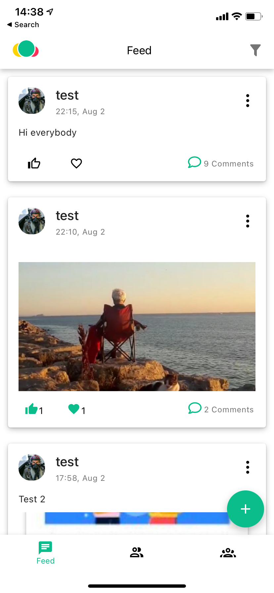
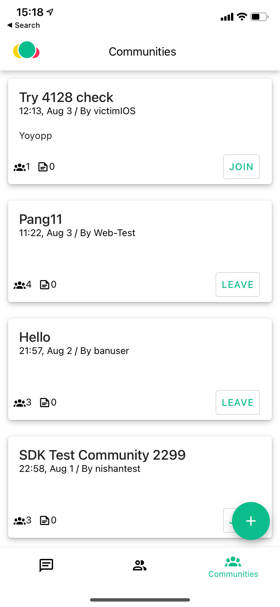
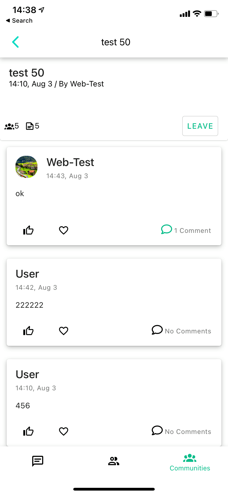
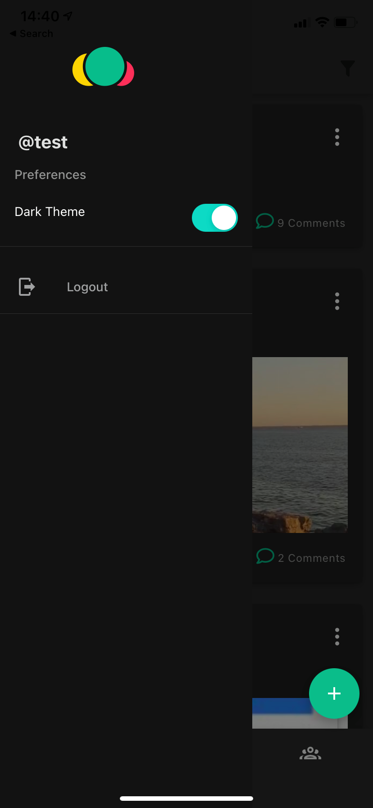
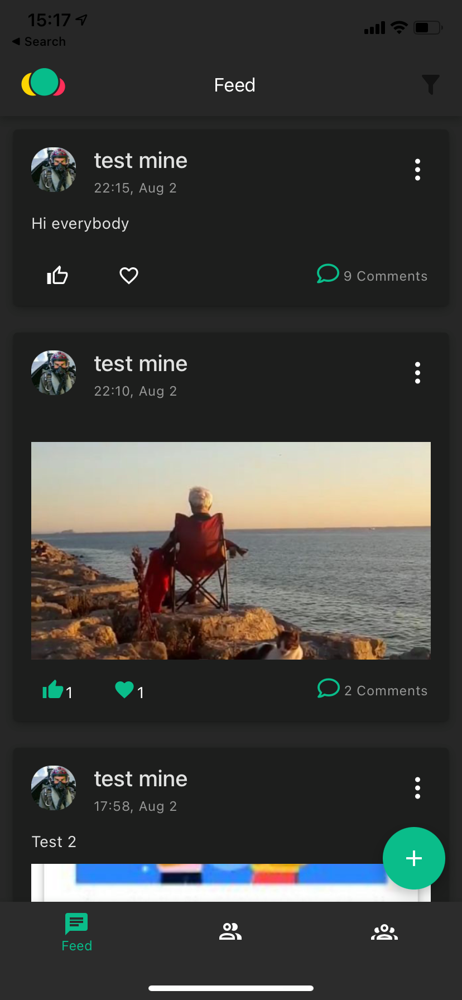
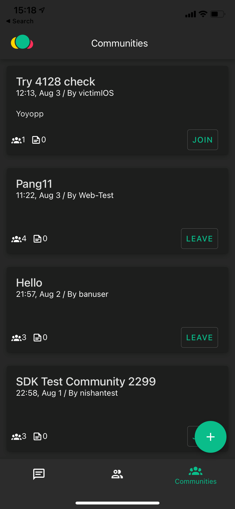

<p align="center">
  
</p>

# Amity Social Cloud React Native Sample App

This repository contains a sample application for variety of sample apps to fit all the typical use-cases you may encounter. Since the application is using a beta version of our TypeScriptSDK, this application may not be fully stable and is subject to change.

# Getting Started
First, install all the dependency.
```
npm install
```
To start the expo app,
```
npm run start
```
Note: the command can be excuted with `--ios`, `--web`, or `--android` flag to run on the specific platform.

# Documentation
Please visit our [TypeScript Documentation](https://app.gitbook.com/@eko/s/typescript-sdk-beta/) for more details.

# Features Available
## Social

The list of features available for Social SDK are:
- Community
    - Create / Delete / GetOne / GetMany / Query / Update
    - Join / Leave
- Post
    - Create / Delete / GetOne / GetMany / Query / Update
- Comment
    - Create / Delete / GetOne / GetMany / Query / Update
- Reaction
    - Add / Remove
- Files (Image / file)
    - Upload image
    - Upload file
- Flags (Report)
    - Add / Remove
    - isFlagByMe
- Users
    - GetOne / GetMany / Query / Update

<p align="center">
  
  
  
</p>

## Dark Theme
This sample app also supports dark theme, which can be enabled from the side menu.
<p align="center">
  
  
  
</p>